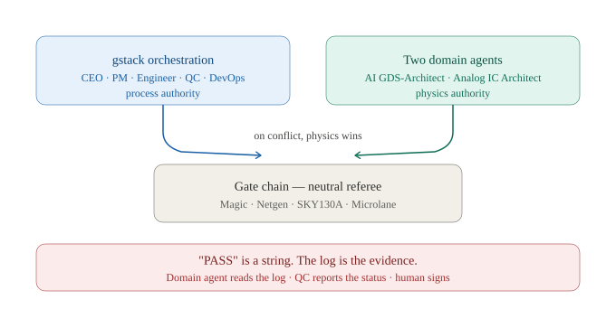

# gstack Tutorial No. 2
## Build an AI-Agent End-to-End EDA System on WorkBuddy

**A step-by-step course for postgraduate students and junior engineers**

Version 1.0 · September 2026 · Prose CC BY 4.0 · Code Apache-2.0

> **One-line summary.** You will use five gstack orchestration roles and two domain
> AI agents to build, run and *verify* a real open-source silicon flow — RTL → GDS
> on the SkyWater SKY130 open PDK — and you will prove it works with a
> verification gate chain and a byte-level hash.

---

## How to use this tutorial

| You are… | Start at | Budget |
|---|---|---|
| A PG student, first exposure | Part 0, then follow straight through | 2 days (10–14 h) |
| A junior engineer with some EDA | Part 0 (skim), Part 2, then Part 3+ | 1 day |
| Teaching a class | Parts 0–1 as lecture, Parts 2–7 as lab, Part 11 as assessment | 4 × 3 h sessions |
| Just evaluating whether to adopt this | Part 0 + Part 8 only | 45 min |

**Rules of engagement**

1. Do not skip Part 0. The mental model is the transferable part; the commands are not.
2. Every Part ends with a **Checkpoint**. You do not advance until it is green.
3. Run the commands yourself. Reading a tutorial about EDA teaches you nothing about EDA.
4. When a gate fails, that is the tutorial working. Read Part 10 before you panic.

---

## Prerequisites

| Item | Requirement | Why |
|---|---|---|
| OS | Windows 11 (macOS/Linux: use the VM path, Part 2 Option C) | the validated chain |
| Disk | 30 GB free recommended, 22 GB absolute minimum | PDK alone is 7.3 GB |
| RAM | 8 GB min, 16 GB comfortable | Magic + P&R |
| Host | Tencent WorkBuddy (or Claude Code / OpenAI Codex) | runs the agents |
| EDA | Magic, Netgen, SKY130A PDK, Microlane — installed in Part 2 | the toolchain |
| Background | Verilog + basic CMOS. No AI background needed. | — |

You do **not** need: a commercial EDA licence, an NDA, a tape-out budget, or any
prior experience with AI agents.

---

# Part 0 — The mental model

**Time: 30 min · No commands**

## 0.1 What gstack gives you

gstack is a library of **agent skills** that turn one AI assistant into a small
engineering organisation. Each skill is a slash command with a defined job, a
defined output, and a defined stop point:

| Command | Role | Job | Stops when |
|---|---|---|---|
| `/plan-ceo-review` | AI CEO | challenge scope, positioning, ambition | scope is defensible |
| `/spec` | AI PM | decompose into filed, assignable work items | backlog is concrete |
| `/plan-eng-review` | AI Engineer | lock architecture, data flow, execution order | plan is buildable |
| `/qa-only` | AI QC | test and report — **without fixing** | report is filed |
| `/ship` | AI DevOps | version, package, document, release | release is tagged |

The value is not that the AI is clever. It is that **each role has a stop point**,
so decisions get audited instead of being silently absorbed.

## 0.2 What Tutorial No. 1 taught, and what this one adds

[Tutorial No. 1](https://github.com/mikelix/gstack-tutorial-1) ran this loop on a
one-line `hello_world.py`. That was the right choice: with no real artifact, nothing
distracts from the process.

But it left three things untaught, and they are exactly what working engineers hit:

| | Tutorial #1 | Tutorial #2 |
|---|---|---|
| Carrier | `hello_world.py` | a real RTL→GDS EDA system |
| Team | 5 gstack **review** roles | 5 gstack roles **× 2 domain agents** |
| Proof of done | review notes merged | **gate chain PASS + GDS SHA match** |
| Environment | none | reproducible open EDA + open PDK |
| Value narrative | — | a system independently valued at ~RMB 1.25 M |

> **The one-line difference:**
> In #1 the agents **review** the work.
> In #2 the agents **do** the work — and are held to a verification gate.

## 0.3 The three-layer model

```
  Layer 1 — gstack orchestration          /plan-ceo-review → /spec
  (decisions & audit trail)                 → /plan-eng-review → /qa-only → /ship
                │
                │  dispatches to
                ▼
  Layer 2 — two domain agents
                • AI GDS-Architect            digital: RTL→GDS, DRC, LVS, determinism
                • Senior Analog IC Architect  analog: sizing, simulation, layout intent
                │
                │  every artifact judged by
                ▼
  Layer 3 — open EDA + open PDK + gate chain
                Magic 8.3.681 · Netgen 1.5.323 · KLayout · ngspice · Xschem
                SKY130A (open_pdks 1.0.572) · Microlane P&R
                Gate 5 DRC → Gate 6 Extraction → Gate 7A LVS → Gate 7B-1R2 LVS
```

Layer 2 is not decorative. Each agent has a **handoff contract**: what it receives,
what it must produce, and which gate judges the result. An agent that produces a
file no gate examines is doing homework, not engineering.

## 0.4 The expertise gap — and who is allowed to decide what

This is the most important section in Part 0, and the one Tutorial No. 1 never
needed.

The five gstack roles are strong at **process**: sequencing, decomposing,
auditing, packaging. They are generalists by design. They have no semiconductor
engineering expertise and no model of how a semiconductor design flow actually
behaves. That is not a defect — it is what makes them good orchestrators. But it
means they must **never be the final authority on a domain question**.

| A gstack role will happily… | …but it does not know that |
|---|---|
| accept "LVS passed" | a naive LVS can be circular and prove nothing |
| accept "DRC clean" | which rule classes actually ran, and what was waived |
| reorder build steps for tidiness | stream order changes the GDS byte stream and breaks determinism |
| suggest "just relax the check to get green" | relaxing a sign-off check is the one unforgivable move |
| package whatever exists | a GDS without a reproducible hash is not a release |
| draft positioning text | a wrong physics number in a slide destroys the whole credibility |

The two domain agents supply exactly what the orchestration layer lacks:
25+ years of CMOS/MEMS and semiconductor engineering judgement, and the workflow
knowledge of how RTL becomes silicon. So the team is not "5 + 2". It is
**5 who decide process, 2 who decide physics — and physics outranks process.**

### The authority contract

| Decision | gstack role | Domain agent | Human |
|---|---|---|---|
| Scope, phasing, work breakdown | **decides** | consulted | approves |
| Which PDK / stdcell library | not allowed | **decides** | approves |
| Tool version pins | records | **decides** | — |
| What counts as a passing gate | runs it | **decides** | — |
| Whether a DRC violation may be waived | not allowed | **decides** | signs |
| Interpretation of an LVS mismatch | reports | **decides** | — |
| Determinism contract | records | **decides** | — |
| Release content and version number | **decides** | consulted | approves |
| Roadmap claims, marketing wording | drafts | **must vet** | approves |
| Any statement containing a physics number | not allowed | **decides** | — |

### Three veto rules

1. **Domain veto beats process convenience.** If the domain agent says a step is
   unsafe, the step does not happen, whatever the plan says.
2. **A gate result is not a fact until the domain agent has read the log, not
   just the status line.** "PASS" is a string. The log is the evidence.
3. **No check is ever relaxed to make a build pass.** When a gate fails, either
   the artifact is wrong or the gate is wrong. The domain agent states which,
   in writing. Nobody silently loosens a tolerance.

### The defer clause (put this in every gstack prompt)

```text
CONSULT REQUIRED. Before you finalise any statement about DRC, LVS, extraction,
determinism, or PDK rules, hand that specific claim to the domain agent
(AI GDS-Architect for digital, Senior Analog IC Architect for analog) and quote
its answer verbatim.

If the domain agent contradicts you, the domain agent wins. Do not resolve the
conflict yourself — escalate to the human with both statements side by side.
```

Copy this block into every `/plan-ceo-review`, `/spec`, `/plan-eng-review`,
`/qa-only` and `/ship` prompt in Parts 3–7. It costs one paragraph and it is the
difference between an AI that sounds right and an AI that is right.

> **Why the domain agents are credible here.** The AI GDS-Architect's
> non-circularity rule (Part 5.3) and the determinism contract (Part 6.3) are not
> invented conventions; they encode failure modes that only appear after years of
> real tape-outs. The analog agent carries a verified 22-year chain — from a
> positive Lyapunov exponent in a chaotic micromixer (2002) through a
> *J. Fluid Mech.* **575**, 425–448 (2007) nonlinear dynamic analysis co-authored
> with Prof. Chih-Ming Ho, to a China Class I certified cancer diagnostic (2023).
> Method verified against measurement at every step. That is the standard the
> orchestration layer is being asked to respect.



Figure 0-1 — The two-key authority model in one picture. Prose version with the
RACI columns and the three veto rights: [`docs/expertise_division.md`](docs/expertise_division.md).

## 0.5 The two domain agents

| Agent | Owns | Produces | Judged by |
|---|---|---|---|
| **AI GDS-Architect** | digital backend: synthesis handoff, P&R, DRC, LVS, stream-out | GDS, extracted netlist, gate logs | Gates 5, 6, 7A, 7B-1R2 |
| **Senior Analog IC Architect** | analog front-end: topology, sizing, simulation, layout intent | sized schematic, sim results, layout constraints | ngspice sim, DRC, (7B-2 on roadmap) |

In this tutorial the digital agent carries the main line (its gates are implemented).
The analog agent is wired in at Part 9 — and Part 9 exists precisely because the
analog half is where a 25-year CMOS/MEMS career lives.

## 0.6 Why SKY130, not a commercial PDK

The author holds NDA-bound PDKs (TSMC, UMC, GlobalFoundries, ams 0.35 µm,
CanSemiconductor). **None of them may appear in this repository.**

1. An NDA PDK cannot be published, redistributed or committed.
2. An "open-source tutorial" that ships a closed PDK is not open source — it is a leak with a README.
3. SKY130 is the first foundry-grade PDK under an open licence, **with open DRC/LVS/RCX
   rule decks**, so every gate here can be re-run, audited and forked by the reader.
4. Nothing is lost: the method is process-agnostic. Gate structure, determinism
   contract and agent workflow transfer to any PDK — including the closed ones.

> **This is itself a lesson.** It teaches "what may be open-sourced" using a decision
> the author actually had to make, not a hypothetical.

## 0.7 What "done" means (hard, not aspirational)

| # | Criterion | Evidence |
|---|---|---|
| 1 | Gate 5 — Magic DRC | PASS, 0 violations |
| 2 | Gate 6 — Magic extraction | PASS |
| 3 | Gate 7A — structural LVS | PASS |
| 4 | Gate 7B-1R2 — Netgen hierarchical LVS | PASS, `Circuits match uniquely.` |
| 5 | **Determinism** | GDS SHA-256 reproducible across runs |
| 6 | **Bilingual docs** | EN + 简体中文 |

If any line fails, you are not finished. There is no "mostly done".

### Checkpoint 0

- [ ] You can name all five gstack commands and each one's stop point.
- [ ] You can state, in one sentence, the difference between Tutorial #1 and #2.
- [ ] You can explain why an NDA PDK cannot appear in this repository.
- [ ] You can name one decision the gstack roles may **not** make, and say who
      makes it instead.
- [ ] You have the defer clause copied somewhere you can paste it from.

---

# Part 1 — Install WorkBuddy and the two domain agents

**Time: 45 min**

## 1.1 Install the host

1. Download Tencent WorkBuddy and install it.
2. Launch it and complete sign-in.
3. Verify the skill system is live by running a trivial prompt:
   > `Reply with the single word: ready`

The agent specs are host-agnostic. If you use Claude Code or OpenAI Codex instead,
copy the two Markdown briefs (Part 1.3) into that host's agent/skill directory.

## 1.2 Install gstack

gstack ships as a skill suite. Install it, then confirm the router responds:

```
@skill:gstack   which skill should I use to review a plan?
```

You should get a routing answer naming `/plan-ceo-review`, `/plan-eng-review`, etc.

If `@skill:gstack` is unavailable, call the skills directly by name — the tutorial
works either way, you just lose the auto-router.

## 1.3 Install the two domain agents

Create the directory `~/.workbuddy/skills/` if it does not exist, then place:

```
~/.workbuddy/skills/
└── e2e-ic-system/
    └── agents/
        ├── ai_gds_architect.md
        └── analog_ic_architect.md
```

**Minimal agent brief you can use today** (save as `ai_gds_architect.md`):

```markdown
---
name: ai-gds-architect
description: Digital backend agent. Use for RTL-to-GDS flows on open PDKs:
  place-and-route, DRC, extraction, LVS, stream-out and deterministic builds.
---

# AI GDS-Architect

## Scope
Digital backend on open PDKs (SKY130A). Owns: P&R, DRC, extraction, LVS, GDS
stream-out, determinism.

## Hard rules
1. Never report PASS without naming the tool, the command, and the log artifact.
2. Never modify a gate to make it pass. If a gate fails, report the failure.
3. Every produced artifact must be reproducible: pinned tool version, seeded RNG,
   PYTHONHASHSEED=0, frozen GDS timestamp.
4. State what you did NOT check. Silence about a gap is a defect.

## Output format
- Artifacts: <path> for every file produced
- Gates: table of gate | tool | status | artifact | notes
- Determinism: sha256 of the GDS, and whether it matches the reference
- Unknowns: explicit list
```

Save the mirror brief as `analog_ic_architect.md` with analog scope (topology,
sizing, ngspice simulation, layout constraints, mismatch/corner analysis).

Restart WorkBuddy. Verify both agents are discoverable:

> `List the agents you can see.`

### Checkpoint 1

- [ ] WorkBuddy responds to a trivial prompt.
- [ ] `@skill:gstack` routes (or you can call skills by name).
- [ ] Both agent briefs exist under `~/.workbuddy/skills/e2e-ic-system/agents/`.
- [ ] WorkBuddy lists both agents after restart.

---

# Part 2 — Install the open EDA toolchain

**Time: 30 min (VM) to 4 h (compile)**

This is the number-one drop-out point. Three paths; **if you have never installed an
open EDA toolchain, take Option C.**

| Path | Platform | Time | Status |
|---|---|---|---|
| **A — one-click installer** `install_eda.bat` | Windows 11 | 1–3 h (compiles) | beta |
| **B — manual step-by-step** | any | 2–4 h | fully documented |
| **C — TinyTapeout VM image (recommended)** | Windows / macOS / Linux | **~30 min** | upstream-maintained |

## 2.1 Pinned versions — do not drift

| Component | Version | Commit | Source |
|---|---|---|---|
| Magic | **8.3.681** | `4432d7e` | github.com/RTimothyEdwards/magic |
| Netgen | **1.5.323** | `bb8a610` | github.com/RTimothyEdwards/netgen |
| open_pdks / SKY130A | **1.0.572** | `54435919` | github.com/RTimothyEdwards/open_pdks |
| Microlane | — | `87079e7f6` | github.com/htfab/microlane |

Version drift is the single most common cause of a mysterious SHA mismatch. Record
what you actually installed in `VERSIONS.lock`.

## 2.2 Option C — the VM image (recommended)

1. Download `tinytapeout_analog_vm.ova` (~5 GB) from
   <https://github.com/TinyTapeout/analog-virtualbox-vm-sky130a> (Apache-2.0).
2. Verify the published SHA-256 before importing.
3. **Change the default machine folder before importing** — it defaults to your system
   drive, which is usually the nearly-full one.
   ```bash
   VBoxManage import tinytapeout_analog_vm.ova --vsys 0 --basefolder D:/VMs
   ```
4. Boot. Login `ttuser` / `magic`.
5. Needs ~20 GB free to import; the virtual disk is provisioned at 32 GB.

**Version note:** the VM pins Magic `8.3.576` and Netgen `1.5.270`; this tutorial pins
`8.3.681` / `1.5.323`. **Expect a different GDS SHA on the VM.** That is expected,
not a failure — re-baseline and move on (see Part 6.3).

## 2.3 Options A / B — native install on Windows

These build inside **Cygwin64**. Two gotchas that cost hours:

1. Use an **isolated launcher** (`env -i`, `MSYS2_ARG_CONV_EXCL='*'`). MSYS path
   mangling otherwise corrupts Windows-style paths and the failure looks like a
   missing file, not a mangled path.
2. Netgen's LVS takes the **4-argument Tcl form** when called from a sourced script:
   ```tcl
   lvs [list $f $cell] [list $f $cell] $SETUP $log
   ```
   The 6-argument form only works through the `-batch lvs` CLI. Mixing them up
   produces an error that looks like a setup-file problem.

## 2.4 Verify before going further

```bash
magic   -dnull -noconsole --version
netgen  -batch -nogui
cat $PDK_ROOT/sky130A/.config/nodeinfo.json     # node, feature-size, open_pdks, magic
ls $PDK_ROOT/sky130A/libs.tech                  # magic netgen klayout ngspice xschem ...
```

Expected on a correct install:

```
node           : sky130A
feature size   : 130 nm
open_pdks      : 1.0.572  (commit 54435919)
magic          : 8.3.681  (commit 4432d7e)
libs.tech      : magic netgen klayout ngspice xschem openlane qflow irsim xcircuit iverilog
stdcell libs   : 11
sky130_fd_sc_hd: 446 cells
```

> **Correction worth internalising:** the open PDK **ships DRC, LVS and RCX rule
> decks** (`libs.tech/klayout/{drc,lvs}`, `rules.openrcx.sky130A.*`). The PEX and
> device-level-LVS gaps are in **our pipeline**, not in the PDK. Fixable, not closed doors.

### Checkpoint 2

- [ ] `magic --version` and `netgen` both respond.
- [ ] `nodeinfo.json` is readable and you have recorded its contents.
- [ ] You know which install path you took and have written it in `VERSIONS.lock`.

---

# Part 3 — Phase 1: AI CEO sets the scope

**Time: 45 min · Command: `/plan-ceo-review`**

## 3.1 Why this comes first

Skipping the CEO review is how projects end up with an unstated, unexamined scope.
Ten minutes here saves a week of building the wrong thing.

## 3.2 Run it

```
@skill:gstack
/plan-ceo-review
```

When prompted, paste this scope statement (adapt the bracketed parts):

```
Project: build an open-source end-to-end EDA system driven by AI agents.

Deliverable: RTL -> GDS on SkyWater SKY130A, verified by a 4-gate chain
(DRC, extraction, structural LVS, hierarchical LVS), producing a byte-reproducible GDS.

Team: 5 gstack roles + 2 domain agents (AI GDS-Architect, Senior Analog IC Architect).

Claimed positioning: teaching/research use, not commercial sign-off.

Questions I need answered:
1. Is the scope too large for one person in 10-14 hours?
2. What should be cut first if time runs short?
3. Is "teaching platform valued at ~RMB 1.25M" a defensible claim, or overreach?
4. What am I not seeing?
```

## 3.3 What a good CEO review gives you

Not flattery. Four things:

1. **A ranking of scope items by risk**, not by excitement.
2. **An explicit cut list** — what to drop when time runs out.
3. **A challenge to your weakest claim.** Here, that is the valuation number.
4. **At least one question you cannot answer yet.** If you get none, the review is shallow.

## 3.4 Write the outcome down

Create `reviews/01-ceo-review.md`. A completed example ships with this tutorial at
[`reviews/01-ceo-review.md`](reviews/01-ceo-review.md) — read it **after** you have
written your own, not before. Its value is its *shape*: blocking issues numbered, a
cut list in priority order, and open questions marked **referred** to a domain agent
rather than answered by a role that has no standing to answer them.

```markdown
# Review 01 — CEO (/plan-ceo-review)
Date:
Command:
Decisions accepted:
Decisions rejected (with reason):
Scope cut list:
Open questions:
```

### Checkpoint 3

- [ ] `reviews/01-ceo-review.md` exists with decisions and a cut list.
- [ ] At least one of your claims was challenged.

---

# Part 4 — Phase 2: AI PM decomposes the work

**Time: 45 min · Command: `/spec`**

## 4.1 Run it

```
@skill:gstack
/spec
```

Paste:

```
Break this into assignable work items.

Fixed constraints (do not change these):
- Pinned tools: Magic 8.3.681, Netgen 1.5.323, open_pdks 1.0.572, Microlane 87079e7f6
- Four gates must pass: 5 (DRC), 6 (extraction), 7A (structural LVS), 7B-1R2 (Netgen LVS)
- Output must be byte-reproducible (SHA-256 recorded each run)
- Two domain agents: AI GDS-Architect (digital), Senior Analog IC Architect (analog)

For each work item give: id, owner role, input, output, gate that judges it,
estimated hours, and what blocks it.
```

## 4.2 The decomposition you should get

| ID | Work item | Owner | Judged by |
|---|---|---|---|
| W1 | Toolchain install + `VERSIONS.lock` | DevOps | Checkpoint 2 |
| W2 | Agent install + handoff contract | DevOps | Checkpoint 1 |
| W3 | `config.env` + isolated launcher | Engineer | launcher runs |
| W4 | P&R to GDS | **AI GDS-Architect** | Gates 5, 6 |
| W5 | Non-circular reference source export | **AI GDS-Architect** | artifact exists, not GDS-derived |
| W6 | LVS pair (7A structural, 7B-1R2 hierarchical) | **AI GDS-Architect** | Gates 7A, 7B-1R2 |
| W7 | Determinism proof (repeat run, compare SHA) | QC | SHA identical |
| W8 | Analog sizing + sim (optional track) | **Senior Analog IC Architect** | ngspice sim |
| W9 | Bilingual docs + release package | DevOps | DoD §0.6 |

A worked decomposition, with the critical path and the three questions that were
escalated to the domain agents instead of being guessed, is in
[`reviews/02-spec.md`](reviews/02-spec.md). Note the escalations: they are the defer
clause working.

## 4.3 Configure the environment

`config.env` (copy from the template, never commit secrets):

```bash
EDA_ROOT=D:/ipason/EDA
PDK_ROOT=$EDA_ROOT/open-pdks-sky130/share/pdk
PDK=sky130A
STDCELL_LIB=sky130_fd_sc_hd
MICROLANE_SRC=$EDA_ROOT/microlane_dbexport/src
MICROLANE_ORIG=$EDA_ROOT/microlane
RUN_DIR=$EDA_ROOT/microlane-e2e-test/e2e-results/sky130A/run01
PROJECT_NAME=my_first_gds
SOURCE_VERILOG=$RUN_DIR/source.v
CYGWIN_ROOT=D:/ipason/EDA/Cygwin
```

A ready-to-edit copy is in [`starter/config.env.example`](starter/config.env.example).
Copy it, set **every** path, and never commit the result — it is machine-specific.

### Checkpoint 4

- [ ] Nine work items filed with owners and judging gates.
- [ ] `config.env` written and sourced successfully.

---

# Part 5 — Phase 3: AI Engineer runs RTL → GDS

**Time: 3–5 h · Command: `/plan-eng-review` · Agent: AI GDS-Architect**

## 5.1 Run the engineering review first

```
@skill:gstack
/plan-eng-review
```

Ask it to lock: data flow, artifact naming, where each gate sits, and **what
happens to the run directory when a gate fails**. That last question is the one
juniors never ask and always regret.

Append the **defer clause** (Part 0.4) to this prompt. The AI Engineer is a
generalist: it will propose a tidy build order unless you force it to defer on
domain questions.

## 5.2 Dispatch the domain agent

In WorkBuddy, activate **AI GDS-Architect** and prompt:

```
You are the AI GDS-Architect. Execute work item W4: place-and-route to GDS.

Inputs:
- config.env: <path>
- source Verilog: <path>
- PDK: sky130A, stdcell lib sky130_fd_sc_hd

Requirements:
1. Use the isolated launcher (env -i, MSYS2_ARG_CONV_EXCL='*'). No bare shell.
2. Before GDS stream-out, run the DB source export hook so the LVS reference comes
   from the live P&R database, NOT from the GDS. Explain in your report why this matters.
3. Freeze the GDS timestamp; set PYTHONHASHSEED=0; seed any RNG explicitly.
4. Write every log to RUN_DIR with a stable name.

Report: artifacts (paths), gate status table, sha256 of the GDS, and unknowns.
```

## 5.3 The non-circularity rule (this is the intellectual core)

The naive LVS is **circular**: compare a netlist extracted from the GDS against a
netlist derived from that same GDS. It will always pass. It proves nothing.

The fix, and the reason Gate 7B carries the suffix **1R2**:

- Emit the reference source from the **live place-and-route database**, before
  stream-out (`db_source_export.py`, hooked in pre-`gds_streamout`).
- Take decap power/ground from the authoritative PDK CDL/SPICE, not from the layout.
- Only then compare with Netgen.

```
   P&R database  ──► db_source_export.py ──► reference source ──┐
                                                                 ├─► Netgen LVS
   P&R database  ──► GDS ──► Magic extract ──► layout netlist ──┘
```

Two independent derivations from one live database. That comparison has diagnostic power.

## 5.4 Run the gates

```bash
# Gate 5 — DRC
magic -dnull -noconsole run_drc.tcl

# Gate 6 — Extraction
magic -dnull -noconsole run_extract.tcl

# Gate 7A — Structural LVS (Microlane comparator)
python lvs.py

# Gate 7B-1R2 — Hierarchical LVS (Netgen)
netgen -batch source run_lvs.tcl
```

Netgen's 4-argument form inside `run_lvs.tcl`:

```tcl
lvs [list $f $cell] [list $f $cell] $SETUP $log
```

**Do not type these four commands by hand.** They are wired together, with the
circularity guard and the fingerprint, in
[`starter/scripts/run_all.sh`](starter/scripts/run_all.sh):

```bash
cd starter
cp config.env.example config.env     # edit every path first
./scripts/run_all.sh
```

It enforces the exit-code contract adopted in review 03:

| Code | Meaning |
|---|---|
| `0` | all gates PASS |
| `1` | a gate FAILED |
| **`2`** | a gate returned **VOID** — the reference came from the GDS, or an input cannot be verified |
| `3` | environment error (bad config, missing tool, reused `RUN_DIR`) |

VOID having its own code is the point. A reviewer skimming, or a CI job asserting
only on non-zero, cannot then mistake "the check proved nothing" for "the check
passed".

## 5.5 What passing looks like

| Gate | Expected output |
|---|---|
| 5 | DRC clean, 0 violations (any waiver listed explicitly) |
| 6 | extraction completes; warnings enumerated |
| 7A | structural match |
| 7B-1R2 | `Circuits match uniquely.` |

### Checkpoint 5

- [ ] A GDS file exists at a known path.
- [ ] Gates 5 and 6 PASS, with log artifacts.
- [ ] The reference source came from the P&R DB, and you can say why that matters.

---

# Part 6 — Phase 4: AI QC verifies, and you prove determinism

**Time: 2–3 h · Command: `/qa-only` · Note: `/qa-only` reports, it does not fix**

## 6.1 The organisational rule

> **The person who ran a gate cannot certify it.**

If solo, separate them in time: run the gates, sleep, verify the next day with fresh
eyes and a clean shell. This is not ceremony — it is the only defence against
confirmation bias, which is the dominant failure mode in AI-assisted engineering.

**Add the fourth rule, specific to this tutorial:**

> **AI QC may report a gate status only after the domain agent has read the log.**
> `/qa-only` is a generalist. It will faithfully report `Circuits match uniquely.`
> and never notice that the comparison was run against a netlist derived from the
> same GDS — the circular case in Part 5.3. Only AI GDS-Architect can catch that.

So the sequence is: **domain agent reads the log → QC reports the status → human
signs.** Never QC alone.

## 6.2 Run the QA pass

```
@skill:gstack
/qa-only
```

Ask for: gate status table with artifacts, SHA comparison, **and an explicit list of
what was NOT checked**.

The last item is the one people drop, and it is the one that matters. See
[`reviews/04-qa-report.md`](reviews/04-qa-report.md) — its "What was NOT checked"
table is eight rows long and is the most useful part of the entire review.

## 6.3 Prove determinism

Run the whole chain twice in clean shells and compare:

```bash
sha256sum $RUN_DIR/*.gds
```

Record:

```markdown
# VERSIONS.lock
magic        8.3.681   (4432d7e)
netgen       1.5.323   (bb8a610)
open_pdks    1.0.572   (54435919)
microlane    —         (87079e7f6)
platform     Windows 11 + Cygwin64
run 1 sha256 6ef1c9c9…322bf750
run 2 sha256 <must be identical>
```

**Two platforms, two baselines.** The Windows/Cygwin chain and the TinyTapeout VM
chain *will* produce different SHAs (different PDK build, different tool revisions).
Publish both. Do not "fix" a mismatch by relaxing the check — investigate it.

## 6.4 Report to the channel

Post to `#gate-results`:

```
gate: 7B-1R2
tool: netgen 1.5.323
status: PASS
sha256: <gds sha>
artifact: <path>
notes: <waivers, warnings, anything a reviewer must know>
```

### Checkpoint 6

- [ ] Gates 7A and 7B-1R2 PASS with artifacts.
- [ ] Two independent runs produce an identical SHA, recorded in `VERSIONS.lock`.
- [ ] `reviews/04-qa-report.md` lists what was **not** checked.

---

# Part 7 — Phase 5: AI DevOps ships it

**Time: 1–2 h · Command: `/ship`**

## 7.1 Run it

```
@skill:gstack
/ship
```

Worked example: [`reviews/05-ship.md`](reviews/05-ship.md) — release contents, the
bilingual parity check, the licence table, and the four-file-rule audit.

## 7.2 What must be in the release

| Item | Why |
|---|---|
| `VERSIONS.lock` | reproducibility |
| Gate logs for all four gates | evidence |
| GDS + reference SHA | the artifact and its fingerprint |
| `README.md` (EN) + `README.zh.md` (ZH) | bilingual, non-negotiable |
| Known limitations section | honesty is a feature |
| Licence | prose CC BY 4.0, code Apache-2.0 |

## 7.3 The four-file rule

Carried over verbatim from Tutorial #1, because it is still true:

> **One conceptual change = 4 files × 4 checks.**

Change a gate definition and you must update: the gate script, the EN doc, the ZH doc,
and the review record — and re-check each. Budget for it. Do not discover this at
the end.

## 7.4 State the limitations plainly

Copy this structure; do not soften it:

```markdown
## Capabilities in this release
- [x] Gate 5 (DRC), Gate 6 (extraction), Gate 7A, Gate 7B-1R2 — all PASS
- [x] Byte-reproducible GDS
- [x] Two domain agents with handoff contracts
- [x] Bilingual documentation

## On the roadmap (v1.1+)
- [ ] PEX / RCX — rules ship with the PDK; pipeline stage missing
- [ ] Post-layout simulation — ngspice available; not wired
- [ ] Full STA — OpenLane/OpenSTA available; requires Docker
- [ ] Gate 7B-2 device-level LVS — KLayout rules ship with the PDK; not wired
- [ ] macOS/Linux validated execution

## Positioning
Teaching/research objectives: ~70–85% covered.
Commercial sign-off: ~15–25%. This is not a Cadence-grade sign-off tool.
```

### Checkpoint 7

- [ ] Release tagged; all six DoD criteria evidenced.
- [ ] Both languages shipped; limitations section is blunt, not softened.

---

# Part 8 — The two disciplines this tutorial actually teaches

Commands expire. These two habits do not.

## 8.1 Discipline 1 — Lock the artifact

Pinned tool versions + `PYTHONHASHSEED=0` + seeded RNG + frozen GDS timestamp ⇒
byte-identical output ⇒ a hash you can publish.

Why it matters: an AI agent can produce something plausible in minutes. The only
thing standing between "plausible" and "engineering" is **a referee that cannot be
argued with**. A hash is such a referee.

## 8.2 Discipline 2 — Check the number, not just the status

A gate can pass and the physics still be wrong. Two worked examples ship with this
tutorial, both from the author's own work:

| Case | Predicted | Measured | Error |
|---|---|---|---|
| Quadcopter hover power (GDA) | 127.8 W | 127.4 W | 0.29% |
| CTC capture critical capillary number Ca\* | 0.043 | 0.04 ± 0.006 | inside band |

Both survive an independent first-principles cross-check. For the hover case:
m = 1.04 kg ⇒ T = 10.20 N; 9.4-inch propellers ⇒ A = 0.179 m²; actuator-disc theory
gives P_ideal = 49.2 W; measured 127.4 W ⇒ implied figure of merit **0.386**, correctly
inside the 0.35–0.45 band for low-Reynolds 9.4-inch props.

**And both state their falsifiable assumption openly:**

> FM = 0.39, taken independently from propeller data — **not** fitted to this flight.

That sentence is the whole lesson. Volunteering the assumption under which your
number could be wrong is what converts a claim into evidence. An expert audience
trusts you more for it, not less.

> **Exercise:** find the equivalent sentence for your own GDS. (Hint: it involves
> the PDK build commit.)

---

# Part 9 — Bringing in the analog agent

**Time: 2–4 h · Agent: Senior Analog IC Architect**

The digital chain above is fully gated. The analog half is where the second agent earns
its place — and where a CMOS/MEMS background pays off.

## 9.1 What the analog agent owns

| Stage | Tool | Artifact |
|---|---|---|
| Schematic capture | Xschem | `.sch` |
| Sizing / operating point | hand analysis + ngspice op | sizing table |
| Simulation (DC, AC, tran, noise) | ngspice | `.raw`, measured metrics |
| Corners & mismatch | ngspice sweep | corner table |
| Layout intent | Magic | constraint notes → layout |

## 9.2 Dispatch prompt

```
You are the Senior Analog IC Architect. Design and simulate a <topology> on SKY130A.

Spec: <gain, bandwidth, noise, power, supply, load>
Corners: tt/ss/ff, <temperatures>, VDD ±10%.
Deliver: sized schematic, ngspice deck, simulated metrics vs spec table,
         and the one assumption most likely to be wrong.
State explicitly what you did NOT simulate.
```

## 9.3 Why this matters to *you* specifically

The author's own research line runs: nonlinear dynamics → micro chaotic mixing
(λ > 0, KAM torus breakdown, FTLE ridges) → Strouhal scaling law → chaotic mixer
inside a CTC-capture chip (*Angew. Chem. Int. Ed.* 50(13):3084–3088, cover) →
nonlinear 2-DOF m–c–k cell model → clinical validation and certification.

That is 22 years from a Lyapunov exponent to a certified diagnostic. The domain
changed; the discipline did not. **That discipline — lock the artifact, check the
number — is exactly what this tutorial automates with gates and hashes.**

## 9.4 Honest status of the analog track

The analog agent's gates are **not yet implemented** in this release. Its outputs are
judged by simulation and human review, not by the gate chain. Say so in your write-up.

### Checkpoint 9

- [ ] A sized schematic and an ngspice deck exist.
- [ ] Simulated metrics vs spec table filled.
- [ ] The agent named one assumption likely to be wrong.
- [ ] For every dispatch you can name the AI level used (see 9.7) **and the
      engine that verified the result** — not the chatbot, the engine.

---

## 9.5 The workflow the analog agent enforces

Part 5 taught a digital line: RTL → GDS through four gates. Ask the analog agent
to design a low-noise CMOS sensor amplifier and it will **not** start by drawing a
schematic. It starts with the sensor and the product spec, and it works through
roughly twenty phases, in this order:

| # | Phase | What it feeds |
|---|---|---|
| 1 | Sensor model and product specifications | the target every later number is judged against |
| 2 | Signal / noise / dynamic-range budget | per-block allocations — the spec becomes arithmetic |
| 3 | PDK device characterization | real f_T, noise and matching data, not textbook models |
| 4 | Architecture comparison | candidates killed on paper, not in silicon |
| 5 | g_m/I_D-based first sizing | initial W, L, I_D from lookup, not from guesswork |
| 6 | Hand calculation | the number the simulator must be compared against |
| 7 | Nominal SPICE | first confrontation between hand numbers and physics |
| 8 | Noise-contribution analysis | which device eats the noise budget |
| 9 | Architecture / system behavioral simulation | loop-level behaviour before transistor-level grind |
| 10 | PVT corners | does it survive process, voltage, temperature |
| 11 | Monte Carlo / mismatch | a distribution, not a point |
| 12 | Automated optimization / design centering | move the distribution, not the nominal |
| 13 | Early floorplan | critical devices placed before routing exists |
| 14 | Critical-device layout | matching and parasitics by construction |
| 15 | Progressive PEX | parasitics extracted incrementally, not at the end |
| 16 | Post-layout noise / stability / PVT | the numbers you will actually get |
| 17 | High-sigma / yield analysis | six-sigma corners, not three-sigma hope |
| 18 | Reliability / aging / EMIR | it must still work in ten years |
| 19 | AMS / full-chip verification | the analog block inside its digital context |
| 20 | Tapeout → characterization → model correlation | silicon measured vs silicon predicted |

Phases 1–3, 10–12, 16–17 and 20 are exactly where this tutorial's gate philosophy
lives: each produces an artifact that either agrees with a previous artifact or
explains, with evidence, why it does not.

**For PG students:** learn this sequence before you learn any tool. The sequence
*is* the expertise; the tools are interchangeable.

## 9.6 The philosophy in one line

The whole workflow compresses to:

```
Specs → Physics → Architecture → Optimization → Statistics → Layout → Silicon
```

and emphatically **not** to:

```
draw schematic → SPICE → layout
```

Every arrow in that chain is a gate in the sense of Part 5: something crosses it
(an artifact, a number, a distribution) and something judges it (a hand
calculation, a corner sweep, a measurement). If you cannot name the artifact that
crosses an arrow, the arrow did not happen — write the phase down as VOID and
move on honestly. This is the same exit-code discipline you applied to LVS:
a stage that produced no comparable artifact did not pass, it merely ran.

## 9.7 Where AI belongs — the four levels

Divide AI usage in analog IC design into four levels. The levels are defined not
by what the AI *does* but by **what verifies it**:

| Level | AI does | Verified by | Status in 2026 |
|---|---|---|---|
| **1 — engineering assistant** | derive equations; write Ocean/SKILL/Python scripts; generate test benches; analyse simulation logs; plot trade-offs | the engineer reads everything it produces | very useful today |
| **2 — design-space optimizer** | choose W, L, I_D, C, R inside constraints you set | the simulator — the only referee | very useful when constrained correctly |
| **3 — layout assistant** | placement, routing, constraint capture, parasitic optimization | DRC/LVS gates plus layout-aware checks | moving fast: Synopsys publicly describes an AI-assisted analog layout synthesis flow that captures design intent and constraints, produces DRC-clean layouts and performs layout-aware optimization; in 2026 it reported customer deployment progress and substantial reductions in layout iterations |
| **4 — autonomous engineering agents** | orchestrate EDA tasks end to end | physics-based EDA engines, continuously | emerging now: vendors integrate agentic systems that orchestrate EDA tasks but continuously check their conclusions against physics-based EDA engines — Siemens explicitly describes this "self-verifying" agent model rather than allowing an LLM alone to determine correctness |

That distinction is crucial, and it is the whole point of this tutorial:

> **Level 4 is what this tutorial builds with open tools — under a different
> name.** The two-key authority contract (Figure 0-1) is the same idea: the LLM
> never determines correctness; the physics engine does. If a vendor promises
> autonomous analog design without naming the engine that verifies it, you now
> know exactly which question to ask.

---

# Part 10 — Troubleshooting

| Symptom | Likely cause | Fix |
|---|---|---|
| `magic: command not found` | not on PATH, or Cygwin not launched isolated | use the launcher; check `config.env` |
| GDS SHA differs between runs | version drift, or non-frozen timestamp | re-check `VERSIONS.lock`; freeze timestamp; `PYTHONHASHSEED=0` |
| GDS SHA differs on the VM | different PDK build (`bdc9412`) and tool revisions | expected — publish a second baseline |
| Netgen: setup file error | used 6-arg form in a sourced script | use 4-arg: `lvs [list $f $cell] [list $f $cell] $SETUP $log` |
| Paths look corrupted (`D:ipason` no slash) | MSYS path mangling | `env -i` + `MSYS2_ARG_CONV_EXCL='*'` |
| LVS passes suspiciously easily | circular comparison (GDS vs GDS) | verify the reference came from the P&R DB |
| Gate passes but result is wrong | gate checks form, not physics | Discipline 2: recompute from first principles |
| Install fails on Windows | — | fall back: Option C (VM) → Option B (manual) → open an issue |

When you open an issue, always include:

```bash
magic --version; netgen --version; cat $PDK_ROOT/sky130A/.config/nodeinfo.json
```

---

# Part 11 — Assessment (for taught courses)

## A. Lab exercises

1. **Reproduce.** Run the chain twice, publish both SHAs. (Tests determinism.)
2. **Break it deliberately.** Change a stdcell lib to `sky130_fd_sc_hs`, re-run,
   explain the SHA change. (Tests version discipline.)
3. **Circular LVS.** Compare GDS-derived netlist against GDS-derived netlist. Show it
   passes. Explain why it is worthless. (Tests the non-circularity rule.)
4. **Physics vs status.** Take a gate that passes and find a quantity the gate does
   *not* check. Compute it by hand. (Tests Discipline 2.)
5. **Agent accountability.** Ask the GDS agent for a PASS with no artifact. Show how
   the brief's hard rules should have blocked it. (Tests handoff contract.)

## B. Written questions

1. Why can an NDA PDK not appear in an open-source tutorial? Give two reasons.
2. State the difference between Tutorial #1 and #2 in one sentence.
3. What makes Gate 7B-1R2 non-circular?
4. A colleague says "the gates all passed, so the design is correct." Respond.
5. Your GDS SHA changed after a tool update. Is this a bug? What do you do?

## C. Grading rubric

| Criterion | Weight |
|---|---|
| All four gates PASS with artifacts | 30% |
| SHA reproducible and recorded | 20% |
| Limitations stated honestly and specifically | 20% |
| Discipline 2 demonstrated (a number recomputed by hand) | 20% |
| Bilingual or clearly documented output | 10% |

---

# Part 12 — Where to go next

| Track | What it adds | Effort |
|---|---|---|
| **PEX / RCX** | wire `rules.openrcx.sky130A.*` into the chain | medium — rules ship with the PDK |
| **Gate 7B-2** | device-level LVS via KLayout + `libs.tech/klayout/lvs` | medium — rules ship with the PDK |
| **Post-layout sim** | ngspice on the extracted netlist | medium |
| **Full STA** | OpenLane / OpenSTA | high — requires Docker |
| **Tape-out** | TinyTapeout shuttle, from $100 | low once GDS is clean |
| **Analog gate chain** | give the analog agent real gates | high, high value |

**Stand on these shoulders:**

| Project | Role |
|---|---|
| [google/skywater-pdk](https://github.com/google/skywater-pdk) | the open foundry-grade PDK |
| [open_pdks](https://github.com/RTimothyEdwards/open_pdks) | PDK build/install framework |
| [Magic](https://github.com/RTimothyEdwards/magic) · [Netgen](https://github.com/RTimothyEdwards/netgen) | DRC / extraction / LVS |
| [Microlane](https://github.com/htfab/microlane) | lightweight open place-and-route |
| [Tiny Tapeout](https://tinytapeout.com) (Matt Venn, Uri Shaked) | low-cost tape-out shuttle |
| [Zero to ASIC Course](https://zerotoasiccourse.com) | teaches the same tools **without** AI agents |
| [SiliWiz](https://app.siliwiz.com) | browser-level silicon intuition, Apache-2.0 |

**Positioning, stated plainly:** Zero to ASIC teaches humans to design chips with
open tools. This tutorial teaches how to run the same flow with **gstack plus two
domain agents**, with the output locked by a gate chain and a hash. Adjacent layers,
not competitors.

---

# Appendix A — Prompt library

**CEO**
```
/plan-ceo-review
Challenge this scope. What should I cut first? Which of my claims is weakest?
What am I not seeing?
```

**PM**
```
/spec
Decompose into work items with: owner, input, output, judging gate, hours, blockers.
Do not change these fixed constraints: <list>
```

**Engineer**
```
/plan-eng-review
Lock the data flow and artifact naming. What happens to the run directory when a
gate fails? Where does each gate sit?
```

**Domain agent dispatch (always include these four lines)**
```
1. State the artifacts you produced, with paths.
2. State which gate judged each one, and its status.
3. State the sha256 of the GDS and whether it matches the reference.
4. State what you did NOT check.
```

**QC**
```
/qa-only
Report, do not fix. Include: gate table with artifacts, SHA comparison, and an
explicit list of what was not checked.
```

**DevOps**
```
/ship
Version, package, write bilingual docs, state limitations without softening, tag release.
```

---

# Appendix B — Review record template

```markdown
# Review NN — <role> (</command>)
Date:
Command:
Inputs reviewed:

## Findings
| # | Finding | Severity | Action |
|---|---|---|---|

## Decisions accepted
## Decisions rejected (with reason)
## Open questions
## What was NOT reviewed
```

---

# Appendix C — Version lock card (print this)

```
Magic          8.3.681   4432d7e
Netgen         1.5.323   bb8a610
open_pdks      1.0.572   54435919
Microlane      —         87079e7f6
PDK            sky130A   130 nm, 5 metal + MiM + RDL
Stdcell        sky130_fd_sc_hd  (446 cells)
PYTHONHASHSEED 0
GDS timestamp  frozen (1970)
Reference SHA  Windows/Cygwin: 6ef1c9c9…322bf750
               TinyTapeout VM: <your own baseline>
```

---

# Appendix D — Glossary

| Term | Meaning |
|---|---|
| **DRC** | Design Rule Check — geometry vs foundry rules |
| **LVS** | Layout vs Schematic — do the two netlists describe the same circuit |
| **PEX / RCX** | Parasitic extraction — turn geometry into R and C |
| **STA** | Static Timing Analysis |
| **GDS** | The final layout database sent to the fab |
| **PDK** | Process Design Kit — rules, models, cells for one process |
| **Gate** | An automated check with a tool, a command, a criterion, and an artifact |
| **Determinism contract** | The set of pins that make output byte-reproducible |
| **Handoff contract** | What an agent receives, produces, and is judged by |
| **Non-circular LVS** | Comparing derivations from a live DB, not GDS against itself |

---

## Licence

Prose **CC BY 4.0**, code **Apache-2.0**. The commercial `e2e-ic-system` product
referenced by this tutorial is not included and remains separately licensed.

**STATUS: complete when your four gates pass and your SHA reproduces.**
